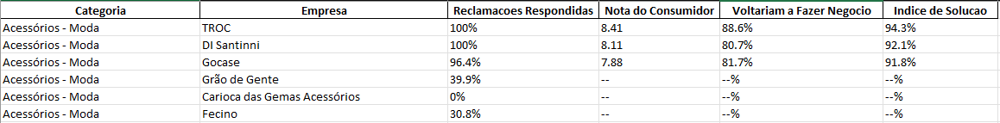
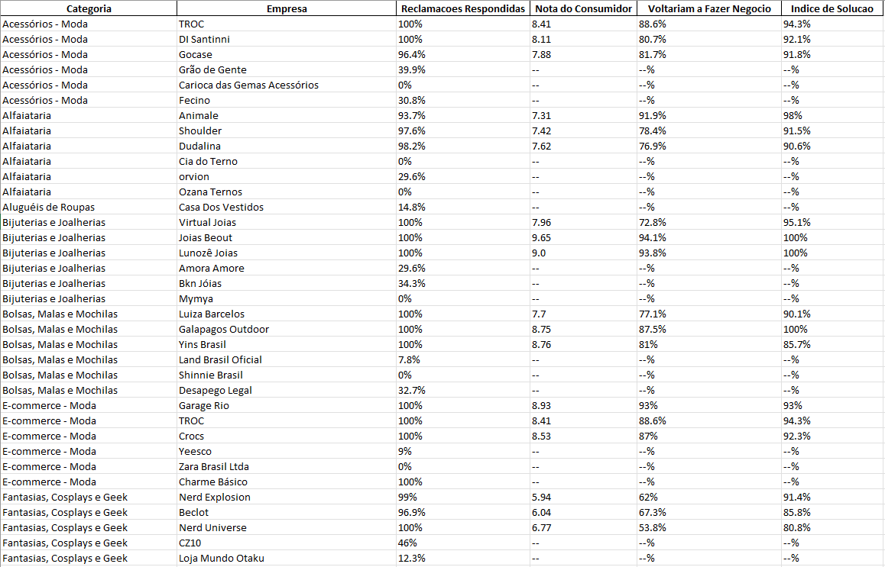
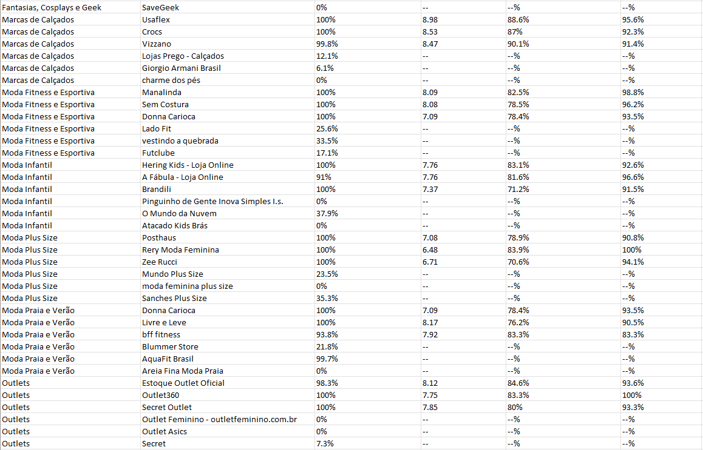
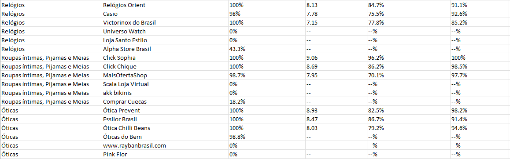

# Desafio Bluetape

Esse projeto realiza uma raspagem de dados para extrair dados das melhores e piores empresas do Reclame Aqui no ramo da moda.

## Funcionalidades
- **Definir Quantidade de Categorias:**
  - Usuário define no momento da execução a quantidade de categorias do ramo da moda a serem analisadas.
- **Extraçao de dados:**
  - Navega até a página do Reclame Aqui 
  - Extrai "nome", "categoria" e "url" das melhores e piores empresas
  - Navega até a url de cada empresa
  - Extrai percentuais de "reclamações respondidas", "voltariam a fazer negócio", "índice de solução" e "nota do consumidor"
-  **Exportação:**
   - Gera um arquivo `dados_empresas.xlsx` com as informações coletadas.

## Resultados
### Uma Categoria Analisada (Default)



### 16 Categorias Analisadas (Máximo)





## Desenvolvimento e Tecnologias
- [Selenium](https://selenium-python.readthedocs.io/)
  - Selenium foi utilizado para automatizar a interação com páginas web, permitindo navegar, clicar em elementos e extrair informações. Essa automação é essencial para simular o comportamento de um usuário e coletar dados diretamente de sites.
- [Pandas](https://pandas.pydata.org/docs/)
  - Pandas foi empregado para manipular e analisar os dados coletados, oferecendo estruturas como DataFrames que facilitam a organização, limpeza e processamento das informações antes de serem armazenadas ou apresentadas.
- [Openpyxl](https://openpyxl.readthedocs.io/en/stable/)
  - Openpyxl foi usado para lidar com arquivos Excel, especificamente para ajustar formatações, já que o Pandas não oferece essa funcionalidade nativamente.
- [Argparse](https://docs.python.org/3/library/argparse.html)
  - Argparse foi utilizado para gerenciar parâmetros de linha de comando, tornando o script mais flexível e configurável. Dessa forma, é possível definir opções como o número de categorias a serem processadas, sem precisar alterar o código diretamente.

## Executando o programa
1. Primeiro, clone o repositório:

    ```bash
    git clone https://github.com/LucasRandazzo/desafio_bt
    ```
### Ambiente virtual

É recomendável usar um ambiente virtual para gerenciar suas dependências. Siga os passos abaixo para configurar um ambiente virtual:

2. Crie um ambiente virtual usando o seguinte comando:

    ```bash
    python -m venv .venv
    ```

3. Ative o ambiente virtual:
   - No macOS e Linux:

    ```bash
    source .venv/bin/activate
    ```
   - No Windows:

    ```bash
    .venv\Scripts\activate
    ```

4. Após ativar o ambiente virtual, você pode instalar as dependências:
   ```bash
    pip install -r requirements.txt
    ```
5. Execute o programa
   - Substitua N pelo número de categorias do ramo da moda a serem analisadas (1 a 16).

    ```bash
    python main.py --total_categorias N
    ```
   - Ou (número de categorias default: 1)

    ```bash
    python main.py
    ```
    
